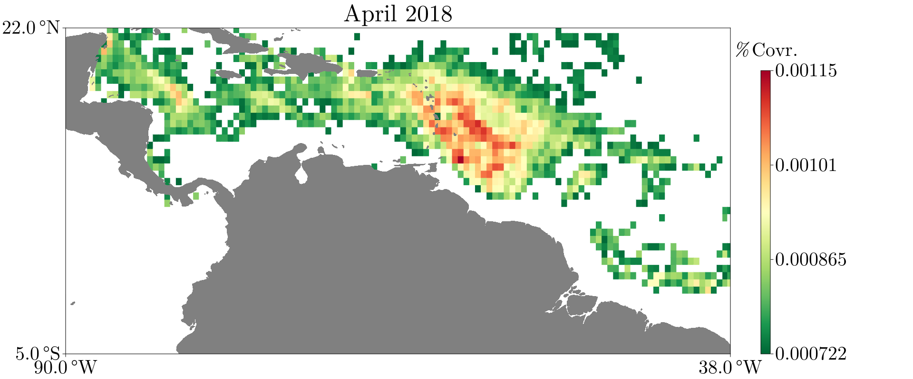
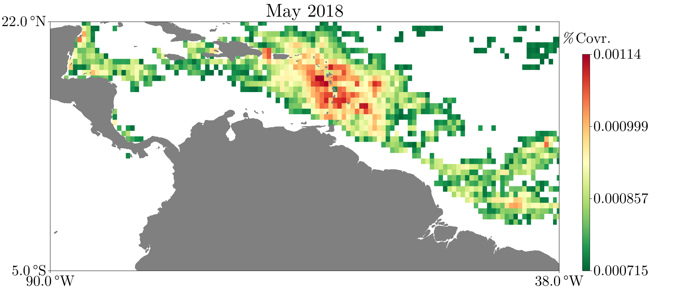

# SargassumFromAFAI

This is a [Julia](https://julialang.org/) package for computing *Sargassum* coverage distributions from AFAI (Alternate Floating Algae Index). The  data are generated based on the [7-day cumulative USF AFAI Fields](https://cwcgom.aoml.noaa.gov/erddap/griddap/noaa_aoml_atlantic_oceanwatch_AFAI_7D.html) and according to the analysis presented in [Wang and Hu, 2016](https://www.sciencedirect.com/science/article/abs/pii/S0034425716301833). It should be noted  that the analysis performed here is *not* identical to Wang and Hu, 2016 and the results here are *not* identical to the results shown in the  [*Sargassum* Watch System](https://optics.marine.usf.edu/projects/saws.html).

These data and results are presented for scientific research purposes **only**.

## Installation

In the Julia REPL, execute the following

```julia
import Pkg
Pkg.add("https://github.com/70Gage70/SargassumFromAFAI.jl.git")
```

## Quickest Start

```julia

using SargassumFromAFAI

dist_april_2018 = SargassumDistribution(EXAMPLE_DIST_APRIL_2018)[(2018, 4)]
plot(dist_april_2018)

```

[](https://70gage70.github.io/SargassumFromAFAI.jl/)


## Quick Start

We'll demonstrate how to generate the *Sargassum* distribution for May 2018 from scratch. Begin by 
downloading the NetCDF data using ERDDAP:

```julia

download_data(2018, 5) # roughly 150 MB .nc file
path_may_2018 = data_path(2018, 5)
```

Now we compute the distribution using the highest level function. This generally 
takes several minutes.

```julia
dist_may_2018 = afai_to_distribution(path_may_2018, 2018, 5)
```

Now we can plot the data

```julia
plot(dist_may_2018)
```

[](https://70gage70.github.io/SargassumFromAFAI.jl/)

And we can save our distribution as a NetCDF file for later use

```julia
distribution_to_nc(dist_may_2018, "dist-2018-5.nc")
```

To load our distribution,

```julia
loaded = SargassumDistribution("dist-2018-5.nc")
```

Note that `loaded` is a dictionary mapping `(year, month)` pairs to distributions. Hence, `loaded[(2018, 5)]` should be equal to `dist_may_2018`. You can check your computed distribution against `EXAMPLE_DIST_MAY_2018`. Save multiple distributions into one NetCDF file via
```julia
distribution_to_nc([dist_april_2018, dist_may_2018], "april_and_may_2018.nc")
```