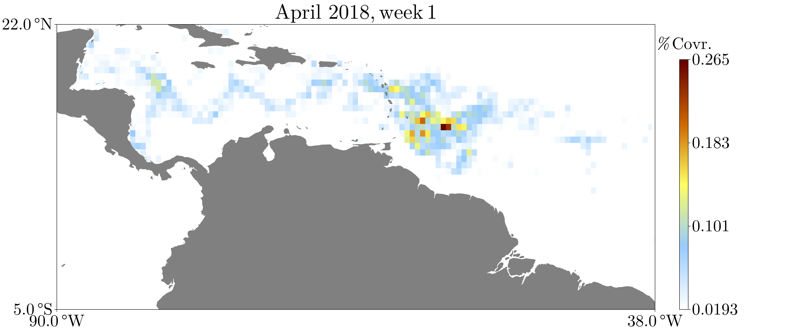
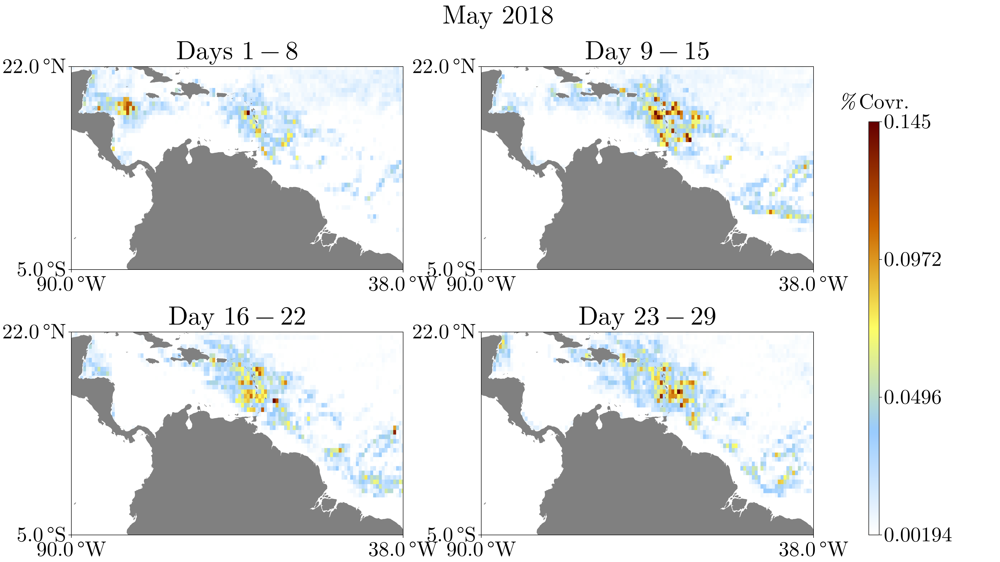

# SargassumFromAFAI.jl

This is a [Julia](https://julialang.org/) package for computing *Sargassum* coverage distributions from AFAI (Alternate Floating Algae Index). The  data are generated based on the [7-day cumulative USF AFAI Fields](https://cwcgom.aoml.noaa.gov/erddap/griddap/noaa_aoml_atlantic_oceanwatch_AFAI_7D.html) and according to the analysis presented in [Wang and Hu, 2016](https://www.sciencedirect.com/science/article/abs/pii/S0034425716301833). It should be noted that, although the analysis performed here is based on Wang and Hu, 2016, it is *not* identical and the results here are *not* identical to the results shown in the  [*Sargassum* Watch System](https://optics.marine.usf.edu/projects/saws.html).

These data and results are presented for scientific research purposes **only**.

## Installation

In the Julia REPL, execute the following

```julia
import Pkg
Pkg.add(url = "https://github.com/70Gage70/SargassumFromAFAI.jl.git")
```

## Quickest Start

```julia
using SargassumFromAFAI

# load a pre-computed Sargassum distribution from April, 2018
dist_april_2018 = SargassumDistribution(EXAMPLE_DIST_APRIL_2018)[(2018, 4)]

# view the weekly distributions
plot(dist_april_2018)
```

[](https://70gage70.github.io/SargassumFromAFAI.jl/)


```julia
# view the distribution of the first week
plot(dist_april_2018, 1)
```

[](https://70gage70.github.io/SargassumFromAFAI.jl/)

We can examine the distribution numerically.

```julia
lon = dist_april_2018.lon
lat = dist_april_2018.lat
time = dist_april_2018.time # 2018-04-01T00:00:00
sargassum = dist_april_2018.sargassum

# check the (monthly) coverage in a specific bin
bin_idx_lon = 70
bin_idx_lat = 30
(lon[bin_idx_lon], lat[bin_idx_lat]) # bin centered at (-66.73, 17.69)
sargassum[bin_idx_lon, bin_idx_lat, 1] # 0.00039946
```

In other words, the bin centered at `(-66.73, 17.69)` contains roughly `0.04%` of the total Sargassum in April.


## Quick Start

We'll demonstrate how to generate the *Sargassum* distribution for May 2018 from scratch. Begin by downloading the NetCDF data using ERDDAP:

```julia

download_data(2018, 5) # roughly 150 MB .nc file
path_may_2018 = data_path(2018, 5)
```

Now we compute the distribution using the highest level function. This generally takes several minutes.

```julia
dist_may_2018 = afai_to_distribution(path_may_2018, 2018, 5)
```

Now we can plot the data

```julia
plot(dist_may_2018)
```

[](https://70gage70.github.io/SargassumFromAFAI.jl/)

And we can save our distribution as a [NetCDF](https://github.com/JuliaGeo/NetCDF.jl) file for later use

```julia
distribution_to_nc(dist_may_2018, "dist-2018-5.nc")
```

To load our distribution later,

```julia
loaded = SargassumDistribution("dist-2018-5.nc")
```

Note that `loaded` is a dictionary mapping `(year, month)` pairs to distributions. Hence, `loaded[(2018, 5)]` should be equal to `dist_may_2018`. You can check your computed distribution against `EXAMPLE_DIST_MAY_2018`. Save multiple distributions into one NetCDF file via
```julia
distribution_to_nc([dist_april_2018, dist_may_2018], "april_and_may_2018.nc")
```

## Advanced Usage

The main computation contains a number of parameters that can be tweaked to change how the final distribution is computed. These parameters are stored in `AFAIParameters` which contains the following fields 

- `window_size_coast_mask`: An `Integer` giving the distance, in gridpoints, such that all 
                            gridpoints within that distance of the coastline are masked (removed.) Default: `20`.
- `window_size_median_filter`: An `Integer` giving the size, in gridpoints of the median filter applied to the data. Default: `51`.
- `threshold_median`: A `Real` such that all median-filtered `afai` values below it are considered to not contain Sargassum. Default: `1.79e-4`.
- `afai_U0`: A `Real` giving the global upper limit on `afai` values for Sargassum-containing pixels. Default: `4.41e-2`.
- `afai_L0`: A `Real` giving the global lower limit on `afai` values for Sargassum-containing pixels. Default: `-8.77e-4`.
- `distribution_quant`: A `Real` giving the quantile below which bins are discarded in the final distribution calculation. Default: `0.85`.

For example, to create a distribution with more non-zero bins, we can lower `distribution_quant`. This will simultaneously have the effect of increasing the noise.

```julia
new_params = AFAIParameters(distribution_quant = 0.7)
new_dist = afai_to_distribution(path_may_2018, 2018, 5, params = new_params)
plot(new_dist)
```

[](https://70gage70.github.io/SargassumFromAFAI.jl/)